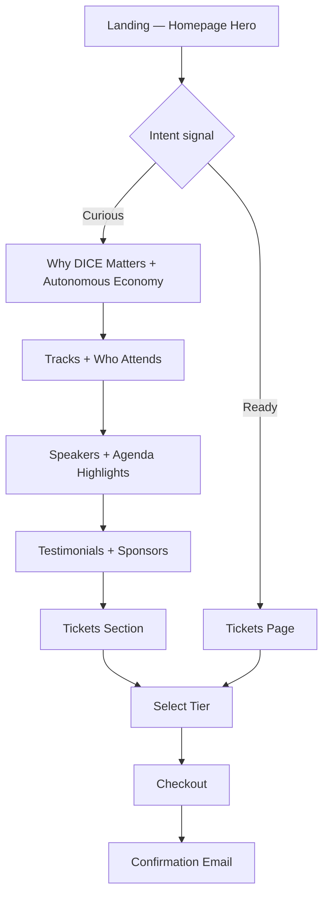
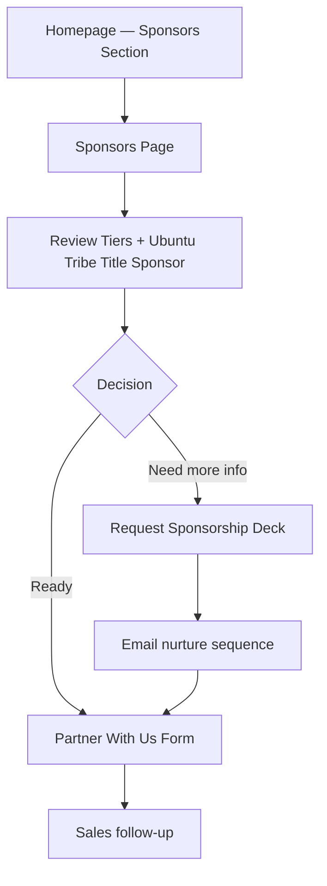

# DICE 2026 — UX Strategy & Information Architecture

**Document Type:** Phase 1 Deliverable — UX Strategy, Conversion Architecture & Experience Blueprint  
**Version:** 1.0  
**Date:** June 6, 2026  
**Status:** Draft for stakeholder review  
**Prepared for:** Blockchain Nigeria User Group (BNUG)  
**Event:** Decentralized Intelligence Conference & Exhibition 2026  

---

## Executive Summary

DICE 2026 requires a digital experience that functions as Africa's strategic convening platform for the autonomous digital economy — not as a promotional event microsite. The website must simultaneously sell high-value tickets, convert global sponsors, recruit world-class speakers, onboard exhibitors and startups, engage institutional investors and government delegations, and establish BNUG as the authoritative voice on Africa's intelligent, decentralized economic infrastructure.

This document defines the complete user experience architecture: who visits, why they visit, what they need to believe before converting, how they move through the site, and how every surface drives measurable business outcomes.

**Primary conversion priority:** Ticket sales  
**Secondary conversion priorities:** Sponsorship revenue, speaker pipeline, exhibitor bookings, investor forum participation, government delegation registration, media partnerships  

**Technical note (stakeholder preference):** Iconography will use `@heroicons/react` (Heroicons) rather than Lucide Icons. This preference is recorded here for Phase 2 (design system) and Phase 3 (engineering) alignment.

---

## 1. Strategic Positioning

### 1.1 What DICE 2026 Is

DICE 2026 is the strategic platform where Africa's autonomous digital economy is defined, financed, regulated, and built. It convenes the institutions, capital, builders, and policymakers required to transition from fragmented digital adoption to coordinated economic autonomy.

### 1.2 What DICE 2026 Is Not

- A blockchain meetup or crypto festival
- A startup pitch competition
- A developer hackathon
- A generic technology conference template

### 1.3 Experience Benchmark

The digital experience must evoke the institutional gravity of the World Economic Forum, the program clarity of GITEX Global, the capital convergence of TOKEN2049, and the narrative precision of a premium product launch — adapted for Africa's future-tech leadership story.

### 1.4 Emotional North Star

> *"This is Africa's most important technology and policy gathering."*

Every page, section, and interaction must reinforce authority, innovation, trust, and economic transformation — without hype, meme culture, or Web3 clichés.

---

## 2. User Personas

### Persona 1 — The Policy Architect

| Attribute | Detail |
|-----------|--------|
| **Title examples** | Central Bank digital strategy lead, Ministry of ICT director, regulatory sandbox coordinator, presidential digital economy advisor |
| **Geography** | Nigeria, ECOWAS, broader Africa, international development bodies |
| **Goals** | Understand regulatory frameworks, assess cross-border digital asset policy, identify public-private partnership models, benchmark peer nations |
| **Pain points** | Fragmented information on AI + blockchain convergence; skepticism of crypto-native events; need for peer-validated, institution-grade content |
| **Entry points** | Government Forum page, media coverage, peer referral, BNUG institutional network |
| **Success metric** | Registers delegation, attends Government Forum sessions, initiates policy dialogue |
| **Decision drivers** | Institutional credibility, speaker calibre, policy-relevant programming, venue gravitas |
| **Primary CTA** | Register Delegation / Government Forum Inquiry |
| **Secondary CTA** | Download Policy Brief / Request Briefing |

---

### Persona 2 — The Capital Allocator

| Attribute | Detail |
|-----------|--------|
| **Title examples** | VC partner, PE principal, family office CIO, crypto fund GP, institutional allocator |
| **Geography** | Lagos, London, Dubai, Singapore, Silicon Valley |
| **Goals** | Source deal flow, assess African fintech/AI infrastructure, meet founders, evaluate regulatory environment |
| **Pain points** | Signal-to-noise ratio at African tech events; difficulty accessing government and enterprise buyers in one venue |
| **Entry points** | Investor Forum, speaker announcements, sponsor visibility, LinkedIn, warm intro from portfolio company |
| **Success metric** | Registers for Investor Forum, books 1:1 meetings, identifies 3+ investment targets |
| **Decision drivers** | Curated founder access, investor-only programming, government co-attendance, data on market size |
| **Primary CTA** | Apply for Investor Forum Access |
| **Secondary CTA** | View Startup Pavilion / Schedule Investor Briefing |

---

### Persona 3 — The Enterprise Strategist

| Attribute | Detail |
|-----------|--------|
| **Title examples** | Bank CTO, telco innovation lead, multinational Africa MD, consulting partner (digital transformation) |
| **Geography** | Lagos, Johannesburg, Nairobi, global HQ with Africa mandate |
| **Goals** | Assess competitive landscape, identify partnership and acquisition targets, understand AI/blockchain infrastructure roadmaps |
| **Pain points** | Events skew too startup-centric or too academic; need executive-level programming with implementation focus |
| **Entry points** | Tracks pages, enterprise speaker roster, sponsorship visibility, industry press |
| **Success metric** | Purchases executive ticket tier, attends 2+ track sessions, initiates partnership conversation |
| **Decision drivers** | Peer enterprise attendance, implementation case studies, exhibition access |
| **Primary CTA** | Register — Executive Pass |
| **Secondary CTA** | Explore Exhibition / Partner With Us |

---

### Persona 4 — The Builder & Founder

| Attribute | Detail |
|-----------|--------|
| **Title examples** | AI startup CEO, fintech founder, blockchain protocol lead, deep-tech CTO |
| **Geography** | Pan-African, diaspora returning, global builders entering African market |
| **Goals** | Raise capital, find enterprise customers, recruit talent, gain visibility, learn from technical leaders |
| **Pain points** | Limited access to investors and government buyers at typical conferences; demo day fatigue |
| **Entry points** | Startup Pavilion, social media, developer community, BNUG network, track-specific content |
| **Success metric** | Applies for Startup Pavilion, secures investor meetings, purchases ticket |
| **Decision drivers** | Investor attendance proof, startup programming quality, media exposure, affordable ticket tiers |
| **Primary CTA** | Apply for Startup Pavilion |
| **Secondary CTA** | Buy Ticket / Apply to Speak |

---

### Persona 5 — The Technical Specialist

| Attribute | Detail |
|-----------|--------|
| **Title examples** | AI engineer, smart contract developer, security researcher, academic, open-source contributor |
| **Geography** | Global, with strong Nigeria and pan-African representation |
| **Goals** | Deep technical learning, network with peers, discover tooling and infrastructure, explore career opportunities |
| **Pain points** | Conference content too high-level; wants substance over keynote platitudes |
| **Entry points** | Agenda, Tracks, Speakers, developer community channels |
| **Success metric** | Purchases standard/developer ticket, attends technical sessions, engages with exhibition demos |
| **Decision drivers** | Technical depth of agenda, speaker credentials, hands-on zones |
| **Primary CTA** | Buy Ticket |
| **Secondary CTA** | View Agenda / Explore Tracks |

---

### Persona 6 — The Media & Analyst

| Attribute | Detail |
|-----------|--------|
| **Title examples** | Tech journalist, financial analyst, podcast host, industry newsletter author |
| **Geography** | Africa-focused and global tech media |
| **Goals** | Access exclusive stories, interview speakers, cover policy announcements, build content pipeline |
| **Pain points** | Generic press releases; needs differentiated angles and access to decision-makers |
| **Entry points** | Media Centre, PR outreach, speaker announcements |
| **Success metric** | Accredits as media, publishes 2+ pieces, amplifies event narrative |
| **Decision drivers** | Newsworthiness, speaker access, press facilities, embargoed announcements |
| **Primary CTA** | Apply for Media Accreditation |
| **Secondary CTA** | Download Media Kit |

---

### Persona 7 — The Sponsor Decision-Maker

| Attribute | Detail |
|-----------|--------|
| **Title examples** | CMO, VP Partnerships, Head of Brand, BD director at technology/financial services company |
| **Geography** | Global companies with Africa market strategy |
| **Goals** | Brand visibility among high-value audience, lead generation, thought leadership positioning, competitive differentiation from rival sponsors |
| **Pain points** | Unclear ROI from conference sponsorships; needs audience quality proof and tier differentiation |
| **Entry points** | Sponsors page, direct outreach, peer sponsor reference, homepage sponsor section |
| **Success metric** | Submits sponsorship inquiry, signs tier agreement |
| **Decision drivers** | Audience composition data, tier benefits clarity, lead sponsor association (Ubuntu Tribe), past event proof |
| **Primary CTA** | Become a Sponsor / Request Sponsorship Deck |
| **Secondary CTA** | View Sponsorship Tiers / Contact Partnerships Team |

---

## 3. Visitor Intent Mapping

| Intent Category | Persona(s) | Typical Entry | Primary Destination | Desired Outcome |
|-----------------|------------|---------------|---------------------|-----------------|
| **Evaluate & decide to attend** | All attendees | Google, social, referral | Homepage → Tickets | Purchase ticket |
| **Assess institutional credibility** | Policy Architect, Enterprise Strategist | Referral, press | About, Government Forum, Speakers | Register with confidence |
| **Source investment opportunities** | Capital Allocator | Network, press | Investor Forum, Startup Pavilion | Apply for forum access |
| **Seek speaking visibility** | Builder, Enterprise, Academic | CFP, peer referral | Speakers, Contact | Submit speaker application |
| **Book exhibition space** | Enterprise, Sponsor | Direct outreach | Exhibition, Partner With Us | Submit exhibitor inquiry |
| **Evaluate sponsorship ROI** | Sponsor Decision-Maker | Sales outreach, homepage | Sponsors, Partner With Us | Request deck, sign tier |
| **Plan logistics** | All attendees | Post-registration | Venue & Travel | Confirm travel plans |
| **Understand programming** | Technical Specialist, all | SEO, agenda share | Agenda, Tracks | Select sessions, buy ticket |
| **Media coverage** | Media & Analyst | PR, Media Centre | Media Centre | Accredit, access kit |
| **Organizational due diligence** | Policy, Enterprise, Sponsor | Institutional referral | About BNUG, About DICE | Trust transfer to BNUG |

---

## 4. Conversion Strategy

### 4.1 Conversion Hierarchy

```
Tier 1 (Revenue-critical)
├── Ticket purchase
└── Sponsorship inquiry → signed agreement

Tier 2 (Pipeline-critical)
├── Speaker application
├── Exhibitor / Startup Pavilion application
├── Investor Forum application
└── Government delegation registration

Tier 3 (Nurture-critical)
├── Email list subscription
├── Media accreditation
├── Sponsorship deck download
└── Contact form inquiry
```

### 4.2 Conversion Principles

1. **One primary action per viewport** — Each screen section has a single dominant CTA; secondary actions are visually subordinate.
2. **Progressive commitment** — Low-friction capture (email) before high-friction forms (sponsorship, investor forum).
3. **Proof before ask** — Social proof (speakers, sponsors, attendance targets) precedes ticket/sponsor CTAs.
4. **Persona-aware routing** — Navigation and footer expose fast paths for Government, Investors, Media, and Sponsors.
5. **Urgency without hype** — Use date proximity, tier availability, and delegate targets — not artificial scarcity language.
6. **Institutional tone at point of conversion** — Forms and confirmation flows maintain executive language; no casual microcopy.

### 4.3 Global CTA Taxonomy

| CTA Type | Label Examples | Use Case |
|----------|----------------|----------|
| **Primary — Revenue** | Register Now, Buy Your Pass, Secure Your Seat | Hero, Tickets section, sticky mobile bar |
| **Primary — Partnership** | Become a Sponsor, Partner With Us | Sponsors page, Partner With Us, hero secondary |
| **Primary — Application** | Apply to Speak, Apply for Startup Pavilion, Request Investor Access | Dedicated forum/pavilion pages |
| **Secondary — Explore** | View Agenda, Explore Tracks, Meet the Speakers | Mid-funnel discovery |
| **Secondary — Capture** | Get Updates, Download Media Kit, Request Sponsorship Deck | Lower-commitment lead capture |
| **Tertiary — Support** | Contact Us, Venue & Travel, About BNUG | Footer, utility navigation |

### 4.4 Friction Reduction Tactics

- Sticky ticket CTA on mobile after hero scroll
- Ticket tier comparison table with recommended tier highlighted
- One-click path from any page to Tickets (persistent nav CTA button)
- Sponsor tier comparison with "Most Popular" indicator on Gold tier
- Speaker application accessible from Speakers page without buried navigation
- Pre-filled UTM parameters preserved through all form submissions for attribution

---

## 5. Conversion Funnels

### 5.1 Attendee Registration Funnel

```
Awareness → Interest → Evaluation → Decision → Purchase → Confirmation
```

| Stage | Touchpoints | Content / Action | Success Signal |
|-------|-------------|------------------|----------------|
| **Awareness** | SEO, social, PR, referral | Hero, press coverage | Landing on homepage |
| **Interest** | Homepage scroll | Why DICE Matters, Tracks, Speakers | 2+ sections viewed |
| **Evaluation** | Agenda, Speakers, Venue | Social proof, programming depth | Visits Tickets or Agenda |
| **Decision** | Tickets page | Tier comparison, inclusions, pricing | Ticket page > 60s dwell |
| **Purchase** | Checkout (external or embedded) | Payment flow | Transaction complete |
| **Confirmation** | Email + on-site | Agenda preview, venue info, add-to-calendar | Email open, calendar add |

**Drop-off mitigation:**
- Abandoned ticket page → retargeting pixel event
- Email capture on Tickets page for "Notify me of early bird deadline"
- Testimonials section positioned before Tickets on homepage

---

### 5.2 Sponsor Conversion Funnel

```
Awareness → Credibility → Tier Evaluation → Inquiry → Negotiation → Signature
```

| Stage | Touchpoints | Content / Action | Success Signal |
|-------|-------------|------------------|----------------|
| **Awareness** | Homepage Sponsors section, press | Title sponsor visibility (Ubuntu Tribe) | Sponsors page visit |
| **Credibility** | Who Attends, Speakers, Government Forum | Audience quality data (5,000+ delegates, 50+ countries) | Downloads deck |
| **Tier Evaluation** | Sponsors page tier matrix | Benefits comparison by tier | Tier selection in inquiry form |
| **Inquiry** | Partner With Us form | Company details, tier interest, objectives | Form submission |
| **Negotiation** | Sales follow-up (off-site) | Custom package, speaking slot, branding | Meeting booked |
| **Signature** | Contract (off-site) | Agreement execution | Sponsor logo on site |

**Key page:** Sponsors + Partner With Us  
**Proof assets needed:** Audience composition infographic, past event metrics (or projected with confidence framing), title sponsor case study

---

### 5.3 Speaker Recruitment Funnel

```
Awareness → Prestige Signal → Application → Review → Confirmation
```

| Stage | Touchpoints | Content / Action | Success Signal |
|-------|-------------|------------------|----------------|
| **Awareness** | LinkedIn, peer referral, BNUG network | Featured Speakers section | Speakers page visit |
| **Prestige Signal** | Speaker roster, track alignment | "Join 150+ global leaders" framing | Apply to Speak click |
| **Application** | Speaker application form | Bio, topic, track preference, headshot | Form submission |
| **Review** | Programme committee (off-site) | Evaluation | Acceptance email |
| **Confirmation** | Speaker portal (future phase) | Session details, logistics | Profile on site |

**Key pages:** Speakers, Contact (speaker path), Tracks  
**CTA placement:** Speakers page hero, footer "For Speakers" link, homepage Featured Speakers section

---

### 5.4 Exhibitor Acquisition Funnel

```
Awareness → Floor Plan Interest → Package Selection → Inquiry → Booking
```

| Stage | Touchpoints | Content / Action | Success Signal |
|-------|-------------|------------------|----------------|
| **Awareness** | Exhibition section, sponsor cross-sell | Experience Zones, foot traffic data | Exhibition page visit |
| **Interest** | Floor plan, zone descriptions | Interactive zone map (Phase 3) | Zone-specific inquiry |
| **Package Selection** | Exhibition packages | Standard, premium, pavilion options | Package selected in form |
| **Inquiry** | Partner With Us / Exhibition form | Company, product category, space needs | Form submission |
| **Booking** | Sales follow-up | Contract, payment | Exhibitor confirmed |

**Key pages:** Exhibition, Experience Zones (homepage), Partner With Us

---

### 5.5 Investor Engagement Funnel

```
Awareness → Access Exclusivity → Application → Vetting → Forum Access
```

| Stage | Touchpoints | Content / Action | Success Signal |
|-------|-------------|------------------|----------------|
| **Awareness** | Investor Forum page, Startup Pavilion | Deal flow narrative, curated access | Investor Forum visit |
| **Exclusivity** | "Application required" framing | 50+ investors, 100+ startups stat | Apply click |
| **Application** | Investor Forum form | Fund name, AUM, investment thesis, focus areas | Form submission |
| **Vetting** | BNUG team review | Qualification check | Approval email |
| **Forum Access** | Confirmation + agenda | Private session schedule, meeting booking | Registration complete |

**Key pages:** Investor Forum, Startup & Investor Ecosystem (homepage), Startup Pavilion

---

### 5.6 Media Partnership Funnel

```
Awareness → Media Centre → Accreditation → Access → Coverage
```

| Stage | Touchpoints | Content / Action | Success Signal |
|-------|-------------|------------------|----------------|
| **Awareness** | PR outreach, Media Centre SEO | Press releases, speaker announcements | Media Centre visit |
| **Accreditation** | Media application form | Outlet, role, coverage plan | Form submission |
| **Access** | Approval + media kit | Logos, bios, images, key messages | Kit download |
| **Coverage** | On-site press room (event day) | Interviews, announcements | Published articles |

**Key pages:** Media Centre, Speakers (for story angles), Press section in footer

---

## 6. Information Architecture

### 6.1 Complete Sitemap

```
dice2026.africa/
│
├── / (Homepage)
│
├── /about
│   └── Mission, vision, autonomous digital economy framing, BNUG relationship
│
├── /agenda
│   ├── Day 1 — August 21, 2026
│   └── Day 2 — August 22, 2026
│
├── /tracks
│   ├── /tracks/agentic-ai
│   ├── /tracks/tokenized-markets
│   ├── /tracks/programmable-finance
│   ├── /tracks/ai-blockchain-infrastructure
│   ├── /tracks/digital-identity-trust
│   ├── /tracks/government-as-platform
│   └── /tracks/future-of-work
│
├── /speakers
│   └── /speakers/[slug] (individual speaker profiles)
│
├── /sponsors
│   └── Tier packages, current sponsors, ROI narrative
│
├── /exhibition
│   └── Floor zones, packages, exhibitor inquiry
│
├── /startup-pavilion
│   └── Application, benefits, selection criteria
│
├── /investor-forum
│   └── Application, programming, meeting format
│
├── /government-forum
│   └── Delegation registration, policy programming
│
├── /media
│   └── Press kit, accreditation, contact
│
├── /venue
│   └── Civic Centre details, hotels, travel, visa guidance
│
├── /tickets
│   └── Tier comparison, pricing, purchase CTA
│
├── /partner
│   └── Sponsorship + exhibitor + ecosystem partnership inquiry
│
├── /contact
│   └── General inquiry, department routing
│
└── /legal (footer utility)
    ├── /privacy
    └── /terms
```

### 6.2 Page Priority Matrix

| Priority | Pages | Rationale |
|----------|-------|-----------|
| **P0 — Launch critical** | Home, Tickets, Sponsors, Partner, About, Agenda, Speakers | Revenue and credibility core |
| **P1 — Pre-launch** | Tracks, Venue, Exhibition, Contact | Programming depth and logistics |
| **P2 — Pipeline** | Startup Pavilion, Investor Forum, Government Forum, Media | Application-driven conversions |
| **P3 — Utility** | Legal pages | Compliance |

### 6.3 Page-Level Objectives

| Page | Primary Objective | Primary CTA | Secondary CTA |
|------|-------------------|-------------|---------------|
| **Home** | Convert visitors to tickets or sponsor inquiries | Register Now | Become a Sponsor |
| **About** | Establish institutional authority | Register Now | Explore Tracks |
| **Agenda** | Drive ticket purchase through programming depth | Buy Your Pass | Apply to Speak |
| **Tracks** | Clarify program, route to ticket purchase | Buy Your Pass | View Agenda |
| **Speakers** | Build prestige, recruit speakers | Apply to Speak | Register Now |
| **Sponsors** | Convert sponsorship interest | Become a Sponsor | Request Deck |
| **Exhibition** | Convert exhibitor interest | Book Exhibition Space | Become a Sponsor |
| **Startup Pavilion** | Capture startup applications | Apply Now | View Investor Forum |
| **Investor Forum** | Capture qualified investors | Request Access | Register Now |
| **Government Forum** | Register delegations | Register Delegation | Contact Policy Team |
| **Media Centre** | Accredit media, enable coverage | Apply for Accreditation | Download Media Kit |
| **Venue & Travel** | Remove logistics friction post-decision | Buy Your Pass | Contact Us |
| **Tickets** | Complete purchase | Select Pass & Register | Group Registration Inquiry |
| **Partner With Us** | Unified partnership pipeline | Submit Inquiry | View Sponsorship Tiers |
| **Contact** | Route inquiries to correct team | Send Message | View FAQ |

---

## 7. Content Hierarchy

### 7.1 Messaging Pyramid

```
Level 1 — Brand Promise (Hero)
"The strategic platform for Africa's autonomous digital economy."

Level 2 — Value Proposition (Why DICE Matters)
"Where intelligence, trust, identity, and capital converge — August 21–22, Lagos."

Level 3 — Proof Points (Who Attends, Speakers, Sponsors, Stats)
5,000+ delegates · 150+ speakers · 50+ countries · 20+ government agencies

Level 4 — Programming Depth (Tracks, Agenda, Forums)
Seven tracks spanning agentic AI, tokenized markets, programmable finance, and policy.

Level 5 — Logistics & Action (Venue, Tickets, Partner)
The Civic Centre, Victoria Island. Register now.
```

### 7.2 Copy Tone Guidelines

| Do | Don't |
|----|-------|
| Economic transformation | "Revolutionary" |
| Infrastructure development | "Disrupting everything" |
| Institutional adoption | "To the moon" |
| Policy alignment | "World's first" |
| Market evolution | Crypto meme language |
| Forward-looking authority | Casual, startup-bro tone |

### 7.3 Content Ownership (for CMS in Phase 3)

| Content Type | Update Frequency | Owner |
|--------------|------------------|-------|
| Speakers | Weekly during recruitment | Programme team |
| Agenda / Sessions | Daily near event | Programme team |
| Sponsors | As deals close | Partnerships team |
| Tickets / Pricing | Monthly | Operations |
| Stats (delegate targets) | Monthly | Marketing |
| Press / Media | As needed | Communications |
| Venue / Travel | Quarterly | Operations |

---

## 8. User Journey Flows

### 8.1 Primary Journey — First-Time Visitor → Ticket Purchase



### 8.2 Sponsor Journey



### 8.3 Multi-Persona Entry Routing

| Entry Point | Recommended First Path |
|-------------|------------------------|
| Google: "AI conference Nigeria" | Home → Tracks → Tickets |
| Google: "blockchain conference Africa" | Home → About → Tickets |
| LinkedIn speaker share | Speakers → Apply to Speak |
| Investor referral | Investor Forum → Application |
| Government referral | Government Forum → Delegation Registration |
| Sponsor sales email | Sponsors → Partner With Us |
| Media pitch | Media Centre → Accreditation |

---

## 9. Navigation Architecture

### 9.1 Primary Navigation (Desktop)

```
[Logo]  About  Agenda  Tracks  Speakers  Sponsors  Venue  [Tickets →]
```

**Overflow / Secondary nav (dropdown "Forums"):**
- Startup Pavilion
- Investor Forum
- Government Forum
- Exhibition
- Media Centre

**Persistent header CTA:** `Tickets` button (electric blue, always visible)

### 9.2 Mobile Navigation

- Hamburger menu with full page list grouped:
  - **Attend** — Tickets, Agenda, Venue, Tracks
  - **Participate** — Speakers, Startup Pavilion, Exhibition
  - **Institutional** — Government Forum, Investor Forum, Media Centre
  - **Partner** — Sponsors, Partner With Us
  - **About** — About DICE, About BNUG, Contact
- **Sticky bottom bar:** `Register Now` (full-width, appears after hero scroll)
- Logo tap → Home

### 9.3 Footer Architecture

```
Column 1: Event          Column 2: Attend         Column 3: Participate
About DICE 2026          Tickets                  Apply to Speak
Agenda                   Venue & Travel           Startup Pavilion
Tracks                   FAQ                      Exhibition
Speakers                                          Investor Forum

Column 4: Partner        Column 5: Connect
Sponsors                 Contact
Partner With Us          Media Centre
Government Forum         About BNUG

Bottom bar: © 2026 BNUG · Privacy · Terms · Social icons
Newsletter capture: "Stay informed on programme announcements"
```

### 9.4 Navigation Principles

- Maximum 7 items in primary desktop nav (Miller's Law)
- Ticket CTA never hidden behind menu
- "Forums" grouping prevents nav clutter while keeping institutional pages accessible
- Footer repeats all conversion paths for deep-page visitors
- Breadcrumbs on inner pages (Tracks, Speakers, individual track pages)

---

## 10. Homepage Section Strategy

Each section below includes purpose, emotional objective, business objective, and conversion objective.

---

### Section 1 — Hero

| Dimension | Definition |
|-----------|------------|
| **Purpose** | Immediate brand positioning and primary conversion |
| **Emotional objective** | Awe, authority, urgency — "This is the defining African tech convening of 2026" |
| **Business objective** | Ticket sales + sponsor awareness |
| **Conversion objective** | Click `Register Now` (primary) or `Become a Sponsor` (secondary) |
| **Content elements** | Event name, theme, date, venue, tagline, animated network background, delegate target stat |
| **Heroicons usage** | `CalendarDaysIcon`, `MapPinIcon` for date/venue meta row |

---

### Section 2 — Why DICE Matters

| Dimension | Definition |
|-----------|------------|
| **Purpose** | Establish why this event exists now — macro context |
| **Emotional objective** | Relevance, urgency of timing — Africa at an inflection point |
| **Business objective** | Authority building, thought leadership |
| **Conversion objective** | Scroll engagement → downstream ticket conversion; optional `Learn More` to About |
| **Content elements** | 3–4 pillar statements on autonomous digital economy, institutional logos or stat row |

---

### Section 3 — The Autonomous Digital Economy

| Dimension | Definition |
|-----------|------------|
| **Purpose** | Define the conference's intellectual frame |
| **Emotional objective** | Intellectual respect — this is a serious economic conversation |
| **Business objective** | Thought leadership, differentiate from crypto conferences |
| **Conversion objective** | Build belief → increase ticket intent; link to Tracks |
| **Content elements** | Narrative copy on intelligence + trust + identity + capital convergence; diagram or animated concept graphic |

---

### Section 4 — Conference Tracks

| Dimension | Definition |
|-----------|------------|
| **Purpose** | Program clarity — show depth and breadth |
| **Emotional objective** | Confidence — "My interests are covered here" |
| **Business objective** | Program clarity, SEO depth |
| **Conversion objective** | Track card click → track detail → ticket; `Explore All Tracks` |
| **Content elements** | 7 interactive cards with track title, one-line description, session count placeholder |
| **Heroicons usage** | Unique icon per track (e.g., `CpuChipIcon`, `CurrencyDollarIcon`, `ShieldCheckIcon`, `BuildingLibraryIcon`) |

---

### Section 5 — Who Attends

| Dimension | Definition |
|-----------|------------|
| **Purpose** | Social proof through audience composition |
| **Emotional objective** | Belonging — "The people I need to meet will be here" |
| **Business objective** | Social proof for all conversion types |
| **Conversion objective** | Reduce hesitation before ticket/sponsor CTAs |
| **Content elements** | Persona cards (Government, Investors, Founders, Enterprise, Developers), attendance stats |

---

### Section 6 — Featured Speakers

| Dimension | Definition |
|-----------|------------|
| **Purpose** | Prestige signal — calibre of voices |
| **Emotional objective** | Aspiration, FOMO (institutional, not hype) |
| **Business objective** | Speaker recruitment + ticket conversion |
| **Conversion objective** | `View All Speakers` + `Apply to Speak` |
| **Content elements** | 6–8 speaker cards (photo, name, title, org), carousel on mobile |

---

### Section 7 — Agenda Highlights

| Dimension | Definition |
|-----------|------------|
| **Purpose** | Engagement depth — show can't-miss sessions |
| **Emotional objective** | Anticipation, programme confidence |
| **Business objective** | Drive ticket purchase through session quality |
| **Conversion objective** | `View Full Agenda` → ticket; `Buy Your Pass` |
| **Content elements** | 4–6 highlighted sessions across both days, time + track badge |

---

### Section 8 — Experience Zones

| Dimension | Definition |
|-----------|------------|
| **Purpose** | Immersion — this is more than a conference |
| **Emotional objective** | Excitement, sensory anticipation |
| **Business objective** | Exhibitor value, ticket differentiation |
| **Conversion objective** | Exhibition inquiry; ticket upgrade interest |
| **Content elements** | Zone cards: Startup Pavilion, Investor Lounge, Government Policy Hall, Innovation Exhibition, Demo Labs |

---

### Section 9 — Startup & Investor Ecosystem

| Dimension | Definition |
|-----------|------------|
| **Purpose** | Deal flow narrative — connect capital and builders |
| **Emotional objective** | Opportunity — "Deals happen here" |
| **Business objective** | Startup Pavilion + Investor Forum pipeline |
| **Conversion objective** | `Apply for Startup Pavilion` + `Request Investor Access` |
| **Content elements** | Stats (100+ startups, 50+ investors), ecosystem diagram, testimonial from past event or projected framing |

---

### Section 10 — Government & Policy Forum

| Dimension | Definition |
|-----------|------------|
| **Purpose** | Institutional credibility anchor |
| **Emotional objective** | Trust, gravitas — policymakers are in the room |
| **Business objective** | Government delegation registration |
| **Conversion objective** | `Register Delegation` + `Explore Government Forum` |
| **Content elements** | Policy focus areas, government agency count stat, quote from policy leader (placeholder until confirmed) |

---

### Section 11 — Exhibition

| Dimension | Definition |
|-----------|------------|
| **Purpose** | Showcase physical experience and sponsor value |
| **Emotional objective** | Scale — large-scale, world-class production |
| **Business objective** | Exhibitor acquisition, sponsor upsell |
| **Conversion objective** | `Book Exhibition Space` + `View Floor Plan` |
| **Content elements** | Floor overview, exhibitor categories, square meterage / booth count stats |

---

### Section 12 — Sponsors

| Dimension | Definition |
|-----------|------------|
| **Purpose** | Revenue conversion + credibility via association |
| **Emotional objective** | Validation — leading brands are investing here |
| **Business objective** | Sponsorship revenue |
| **Conversion objective** | `Become a Sponsor` + `View All Tiers` |
| **Content elements** | Title sponsor feature (Ubuntu Tribe), tier logo grid (Platinum → Media Partner), "Join them" CTA |

---

### Section 13 — Testimonials

| Dimension | Definition |
|-----------|------------|
| **Purpose** | Trust building through third-party voice |
| **Emotional objective** | Confidence, peer validation |
| **Business objective** | Reduce conversion friction |
| **Conversion objective** | Indirect — increases ticket/sponsor click-through on subsequent sections |
| **Content elements** | 3–5 quotes from past attendees, speakers, or sponsors (placeholder until available) |

---

### Section 14 — Venue

| Dimension | Definition |
|-----------|------------|
| **Purpose** | Logistics confidence |
| **Emotional objective** | Assurance — world-class venue, accessible location |
| **Business objective** | Remove travel hesitation |
| **Conversion objective** | `Plan Your Visit` → Venue page; `Register Now` |
| **Content elements** | Civic Centre image, address, Victoria Island context, date/time, map embed |

---

### Section 15 — Tickets

| Dimension | Definition |
|-----------|------------|
| **Purpose** | Primary conversion point on homepage |
| **Emotional objective** | Decision — clear value, clear urgency |
| **Business objective** | Ticket revenue |
| **Conversion objective** | Tier selection → checkout |
| **Content elements** | 3–4 tiers (e.g., Standard, Executive, Government/Institutional, Group), inclusions list, pricing, early bird badge |

**Proposed ticket tiers (subject to stakeholder confirmation):**

| Tier | Target Persona | Key Inclusions |
|------|----------------|----------------|
| **Standard Pass** | Builder, Developer | Full conference access, exhibition, networking |
| **Executive Pass** | Enterprise, Investor | Priority seating, executive lounge, meeting scheduler |
| **Institutional Pass** | Government, Policy | Government Forum access, policy briefings, delegation services |
| **Group Pass (5+)** | Enterprise teams | Discounted rate, team check-in, reserved seating |

---

### Section 16 — About BNUG

| Dimension | Definition |
|-----------|------------|
| **Purpose** | Organizer credibility transfer |
| **Emotional objective** | Trust — credible institution behind the event |
| **Business objective** | Institutional confidence for government and enterprise personas |
| **Conversion objective** | `Learn About BNUG` → external or About section; supports all conversion types |
| **Content elements** | BNUG mission, years of operation, community size, past initiatives |

---

### Section 17 — Final Call to Action

| Dimension | Definition |
|-----------|------------|
| **Purpose** | Last conversion opportunity before footer |
| **Emotional objective** | Urgency — dates are fixed, seats are limited |
| **Business objective** | Ticket sales + sponsor capture |
| **Conversion objective** | `Register Now` + `Become a Sponsor` |
| **Content elements** | Full-width dark section, event date countdown, dual CTA |

---

### Section 18 — Footer

| Dimension | Definition |
|-----------|------------|
| **Purpose** | Navigation recovery, secondary conversions, compliance |
| **Emotional objective** | Professionalism, completeness |
| **Business objective** | Capture missed conversion paths |
| **Conversion objective** | Newsletter signup, footer link to Tickets/Sponsors/Contact |
| **Content elements** | Full sitemap, social links, newsletter form, legal links, BNUG copyright |

---

## 11. Homepage Wireframe

### 11.1 Desktop Wireframe (1440px)

```
┌─────────────────────────────────────────────────────────────────────────────┐
│ [Logo]   About  Agenda  Tracks  Speakers  Sponsors  Venue     [Tickets →]  │  ← Sticky header
├─────────────────────────────────────────────────────────────────────────────┤
│                                                                             │
│                    DICE 2026                                                │
│     Building Africa's Autonomous Digital Economy                            │
│     Where Intelligence, Trust, Identity and Capital Converge                │
│                                                                             │
│     📅 Aug 21–22, 2026  ·  📍 Civic Centre, Lagos                            │
│                                                                             │
│     [Register Now]    [Become a Sponsor]                                    │
│                                                                             │
│     ░░░ Animated network / particle background ░░░                        │
│                                                                             │
│     5,000+ Delegates · 150+ Speakers · 50+ Countries                       │
├─────────────────────────────────────────────────────────────────────────────┤
│  WHY DICE MATTERS                                                           │
│  ┌──────────────┐ ┌──────────────┐ ┌──────────────┐ ┌──────────────┐       │
│  │ Pillar 1     │ │ Pillar 2     │ │ Pillar 3     │ │ Pillar 4     │       │
│  └──────────────┘ └──────────────┘ └──────────────┘ └──────────────┘       │
├─────────────────────────────────────────────────────────────────────────────┤
│  THE AUTONOMOUS DIGITAL ECONOMY                                             │
│  [Narrative copy — left]          [Concept diagram / animation — right]    │
├─────────────────────────────────────────────────────────────────────────────┤
│  CONFERENCE TRACKS                                                          │
│  ┌─────┐ ┌─────┐ ┌─────┐ ┌─────┐ ┌─────┐ ┌─────┐ ┌─────┐                  │
│  │ T1  │ │ T2  │ │ T3  │ │ T4  │ │ T5  │ │ T6  │ │ T7  │                  │
│  └─────┘ └─────┘ └─────┘ └─────┘ └─────┘ └─────┘ └─────┘                  │
│                              [Explore All Tracks]                           │
├─────────────────────────────────────────────────────────────────────────────┤
│  WHO ATTENDS                                                                │
│  ┌────────┐ ┌────────┐ ┌────────┐ ┌────────┐ ┌────────┐                   │
│  │ Gov    │ │ Invest │ │ Founder│ │ Enterp │ │ Dev    │                   │
│  └────────┘ └────────┘ └────────┘ └────────┘ └────────┘                   │
├─────────────────────────────────────────────────────────────────────────────┤
│  FEATURED SPEAKERS                                                          │
│  ┌──────┐ ┌──────┐ ┌──────┐ ┌──────┐ ┌──────┐ ┌──────┐                   │
│  │ Spk1 │ │ Spk2 │ │ Spk3 │ │ Spk4 │ │ Spk5 │ │ Spk6 │                   │
│  └──────┘ └──────┘ └──────┘ └──────┘ └──────┘ └──────┘                   │
│              [View All Speakers]  [Apply to Speak]                          │
├─────────────────────────────────────────────────────────────────────────────┤
│  AGENDA HIGHLIGHTS                                                          │
│  ┌─────────────────────────────┐ ┌─────────────────────────────┐           │
│  │ Session 1                   │ │ Session 2                   │           │
│  └─────────────────────────────┘ └─────────────────────────────┘           │
│              [View Full Agenda]  [Buy Your Pass]                            │
├─────────────────────────────────────────────────────────────────────────────┤
│  EXPERIENCE ZONES                                                           │
│  ┌──────────┐ ┌──────────┐ ┌──────────┐ ┌──────────┐ ┌──────────┐         │
│  │ Startup  │ │ Investor │ │ Gov Hall │ │ Exhibit  │ │ Demo Lab │         │
│  └──────────┘ └──────────┘ └──────────┘ └──────────┘ └──────────┘         │
├─────────────────────────────────────────────────────────────────────────────┤
│  STARTUP & INVESTOR ECOSYSTEM                                               │
│  [Stats + narrative — left]       [Apply CTAs — right]                     │
├─────────────────────────────────────────────────────────────────────────────┤
│  GOVERNMENT & POLICY FORUM                                                  │
│  [Policy areas + quote]           [Register Delegation]                    │
├─────────────────────────────────────────────────────────────────────────────┤
│  EXHIBITION                                                                 │
│  [Floor visual]                   [Book Exhibition Space]                    │
├─────────────────────────────────────────────────────────────────────────────┤
│  SPONSORS                                                                   │
│  ┌─────────────────────────────────────────────┐                           │
│  │         UBUNTU TRIBE — Title Sponsor         │                           │
│  └─────────────────────────────────────────────┘                           │
│  [Platinum] [Gold] [Gold] [Silver] [Silver] [Silver]                       │
│                    [Become a Sponsor]                                       │
├─────────────────────────────────────────────────────────────────────────────┤
│  TESTIMONIALS                                                               │
│  ←  "Quote from institutional attendee"  — Name, Title  →                  │
├─────────────────────────────────────────────────────────────────────────────┤
│  VENUE                                                                      │
│  [Venue image]  Civic Centre, Victoria Island  [Plan Your Visit]           │
├─────────────────────────────────────────────────────────────────────────────┤
│  TICKETS                                                                    │
│  ┌────────────┐  ┌────────────┐  ┌────────────┐  ┌────────────┐           │
│  │ Standard   │  │ Executive  │  │Institutional│  │ Group (5+)│           │
│  │ $XXX       │  │ $XXX ★     │  │ $XXX       │  │ $XXX      │           │
│  │ [Select]   │  │ [Select]   │  │ [Select]   │  │ [Select]  │           │
│  └────────────┘  └────────────┘  └────────────┘  └────────────┘           │
├─────────────────────────────────────────────────────────────────────────────┤
│  ABOUT BNUG                                                                 │
│  [BNUG narrative + logo]          [Learn More]                             │
├─────────────────────────────────────────────────────────────────────────────┤
│  FINAL CTA                                                                  │
│  ┌─────────────────────────────────────────────────────────────────────┐   │
│  │  Join 5,000+ leaders in Lagos · August 21–22, 2026                 │   │
│  │  [Register Now]              [Become a Sponsor]                     │   │
│  │  ████████████████░░░░░░░  Countdown: 76 days                       │   │
│  └─────────────────────────────────────────────────────────────────────┘   │
├─────────────────────────────────────────────────────────────────────────────┤
│  FOOTER — 5 columns + newsletter + legal                                   │
└─────────────────────────────────────────────────────────────────────────────┘
```

### 11.2 Mobile Wireframe (390px)

```
┌─────────────────────────┐
│ [☰]  [Logo]  [Tickets]  │  ← Sticky header
├─────────────────────────┤
│                         │
│      DICE 2026          │
│   Theme statement       │
│   Tagline               │
│                         │
│  📅 Aug 21–22, 2026     │
│  📍 Civic Centre, Lagos │
│                         │
│  [Register Now]         │  ← Full width
│  [Become a Sponsor]     │  ← Ghost button
│                         │
│  Stats row (stacked)    │
├─────────────────────────┤
│  WHY DICE MATTERS       │
│  ┌───────────────────┐  │
│  │ Pillar 1          │  │  ← Vertical stack
│  └───────────────────┘  │
│  ┌───────────────────┐  │
│  │ Pillar 2          │  │
│  └───────────────────┘  │
│  ...                    │
├─────────────────────────┤
│  TRACKS                 │
│  ┌───────────────────┐  │
│  │ Track 1 →         │  │  ← Horizontal scroll
│  └───────────────────┘  │
├─────────────────────────┤
│  SPEAKERS               │
│  ← [Spk1] [Spk2] →     │  ← Carousel
├─────────────────────────┤
│  ... (sections stack)   │
├─────────────────────────┤
│  TICKETS                │
│  ┌───────────────────┐  │
│  │ Standard — $XXX   │  │  ← Accordion or
│  └───────────────────┘  │     vertical cards
│  ┌───────────────────┐  │
│  │ Executive — $XXX  │  │
│  └───────────────────┘  │
├─────────────────────────┤
│  FINAL CTA              │
├─────────────────────────┤
│  FOOTER (accordion nav) │
├─────────────────────────┤
│  [Register Now]         │  ← Sticky bottom bar
└─────────────────────────┘
```

---

## 12. Mobile-First UX Strategy

### 12.1 Design Priorities

1. **Thumb-zone CTAs** — Primary actions in bottom 40% of viewport (sticky bar, section CTAs)
2. **Progressive disclosure** — Accordion for ticket tiers, footer nav groups; horizontal scroll for tracks and speakers
3. **Touch targets** — Minimum 44×44px for all interactive elements
4. **Performance budget** — Hero animation degraded on mobile (CSS-only fallback); lazy load below-fold images
5. **Readable hierarchy** — Single-column layout; max 65 characters per line for body copy

### 12.2 Mobile-Specific Patterns

| Pattern | Application |
|---------|-------------|
| Sticky bottom CTA bar | Appears after hero exit, persists on scroll |
| Horizontal card scroll | Tracks, Speakers, Experience Zones |
| Collapsible ticket comparison | Tap to expand inclusions per tier |
| Full-screen mobile menu | Grouped navigation with section labels |
| Click-to-call / click-to-map | Venue section — phone and maps deep links |
| Reduced motion respect | `prefers-reduced-motion` disables particles and parallax |

### 12.3 Breakpoint Strategy

| Breakpoint | Width | Layout Behavior |
|------------|-------|-----------------|
| **Mobile** | < 640px | Single column, stacked CTAs, hamburger nav |
| **Tablet** | 640–1024px | 2-column grids, condensed nav |
| **Desktop** | 1024–1440px | Full grid, horizontal nav, side-by-side sections |
| **Wide** | > 1440px | Max-width container (1280px), centered content |

### 12.4 Mobile Performance Targets

| Metric | Target |
|--------|--------|
| LCP | < 2.5s on 4G |
| INP | < 200ms |
| CLS | < 0.1 |
| Hero weight | < 150KB (mobile-optimized) |
| Total page weight | < 1.5MB initial load |

---

## 13. SEO Architecture

### 13.1 URL Strategy

- Clean, lowercase, hyphenated URLs
- No trailing slashes (consistent canonical)
- Track and speaker pages for long-tail SEO depth

### 13.2 Primary Keyword Mapping

| Page | Primary Keyword | Secondary Keywords |
|------|-----------------|------------------|
| Home | blockchain conference Africa | AI conference Nigeria, DICE 2026 |
| About | digital economy Africa conference | autonomous digital economy, BNUG |
| Agenda | DICE 2026 agenda | tech conference schedule Lagos |
| Tracks | AI blockchain conference tracks | Web3 conference Africa, fintech conference |
| Speakers | DICE 2026 speakers | tech speakers Africa, conference keynote Lagos |
| Sponsors | conference sponsorship Africa | tech event sponsorship Nigeria |
| Tickets | DICE 2026 tickets | tech conference tickets Lagos, buy conference pass |
| Venue | Civic Centre Lagos conference | Victoria Island event venue, Lagos travel |
| Government Forum | government blockchain policy Africa | digital economy policy conference |
| Investor Forum | Africa startup investor conference | VC conference Lagos, deal flow event |

### 13.3 Technical SEO Requirements

| Element | Implementation |
|---------|----------------|
| **Title tags** | `{Page} | DICE 2026 — {Tagline fragment}` (max 60 chars) |
| **Meta descriptions** | Unique per page, 150–160 chars, include CTA verb |
| **OpenGraph** | Event image (1200×630), title, description, url per page |
| **Twitter Cards** | `summary_large_image` |
| **Schema.org** | `Event` type on homepage + tickets; `Person` on speaker pages; `Organization` on About |
| **Canonical URLs** | Self-referencing on all pages |
| **Sitemap** | Auto-generated `sitemap.xml` |
| **Robots** | Allow all public pages; disallow `/api/`, admin routes |
| **hreflang** | `en` default; prepare `en-NG` if localized content added later |

### 13.4 Schema.org Event Markup (Homepage)

```json
{
  "@context": "https://schema.org",
  "@type": "Event",
  "name": "Decentralized Intelligence Conference & Exhibition 2026",
  "startDate": "2026-08-21T09:00:00+01:00",
  "endDate": "2026-08-22T18:00:00+01:00",
  "eventAttendanceMode": "https://schema.org/OfflineEventAttendanceMode",
  "eventStatus": "https://schema.org/EventScheduled",
  "location": {
    "@type": "Place",
    "name": "The Civic Centre",
    "address": {
      "@type": "PostalAddress",
      "streetAddress": "Ozumba Mbadiwe Avenue",
      "addressLocality": "Victoria Island, Lagos",
      "addressCountry": "NG"
    }
  },
  "organizer": {
    "@type": "Organization",
    "name": "Blockchain Nigeria User Group",
    "url": "https://blockchainnigeria.group"
  },
  "description": "Africa's premier conference on the autonomous digital economy."
}
```

### 13.5 Content SEO Principles

- One H1 per page; logical H2–H4 hierarchy
- Track pages target long-tail: "agentic AI conference Africa 2026"
- Internal linking: every track page links to Tickets and Agenda
- Image alt text: descriptive, keyword-natural (not stuffed)
- Blog/News section (P3) for ongoing SEO content post-launch

---

## 14. Analytics Strategy

### 14.1 Recommended Stack

| Tool | Purpose |
|------|---------|
| **Google Analytics 4** | Page views, events, conversions, audience |
| **Google Tag Manager** | Event management without code deploys |
| **Meta Pixel** (optional) | Retargeting for ticket abandoners |
| **LinkedIn Insight Tag** (optional) | B2B sponsor and enterprise retargeting |
| **Hotjar or Microsoft Clarity** (optional) | Heatmaps, session recordings for UX optimization |

### 14.2 Key Events to Track

| Event Name | Trigger | Conversion |
|------------|---------|------------|
| `cta_click_register` | Any Register/Buy Ticket CTA | Yes — primary |
| `cta_click_sponsor` | Any Become a Sponsor CTA | Yes — primary |
| `ticket_tier_selected` | Ticket tier card click | Yes — micro |
| `form_submit_speaker` | Speaker application submitted | Yes — pipeline |
| `form_submit_sponsor` | Partner/sponsor form submitted | Yes — primary |
| `form_submit_investor` | Investor forum application | Yes — pipeline |
| `form_submit_startup` | Startup pavilion application | Yes — pipeline |
| `form_submit_government` | Government delegation form | Yes — pipeline |
| `form_submit_media` | Media accreditation form | Yes — pipeline |
| `form_submit_newsletter` | Footer email capture | Yes — nurture |
| `form_submit_contact` | General contact form | No |
| `page_view_tickets` | Tickets page load | Micro-conversion |
| `scroll_depth_75` | 75% homepage scroll | Engagement |
| `outbound_click_checkout` | Click to external payment | Yes — revenue |

### 14.3 Conversion Goals (GA4)

| Goal | Event | Target Rate |
|------|-------|-------------|
| Ticket CTA click rate | `cta_click_register` | > 8% of homepage sessions |
| Sponsor inquiry rate | `form_submit_sponsor` | > 2% of Sponsors page sessions |
| Email capture rate | `form_submit_newsletter` | > 5% of total sessions |
| Speaker application rate | `form_submit_speaker` | > 3% of Speakers page sessions |

### 14.4 UTM Convention

```
?utm_source={platform}&utm_medium={medium}&utm_campaign={campaign}&utm_content={variant}

Examples:
- LinkedIn sponsor outreach: ?utm_source=linkedin&utm_medium=social&utm_campaign=sponsor-2026
- Email newsletter: ?utm_source=newsletter&utm_medium=email&utm_campaign=early-bird
- Google Ads: ?utm_source=google&utm_medium=cpc&utm_campaign=tickets-lagos
```

### 14.5 Dashboard KPIs (Weekly Review)

- Unique visitors and source/medium breakdown
- Homepage → Tickets page flow rate
- CTA click-through by position (hero vs. sticky vs. section)
- Form submissions by type
- Bounce rate by landing page
- Mobile vs. desktop conversion comparison

---

## 15. Lead Capture Strategy

### 15.1 Capture Mechanisms

| Mechanism | Location | Fields | Purpose |
|-----------|----------|--------|---------|
| **Newsletter signup** | Footer (every page) | Email, optional role dropdown | Nurture, announcements |
| **Early bird alert** | Tickets page | Email | Price deadline urgency |
| **Sponsorship deck request** | Sponsors page | Name, email, company, tier interest | Sponsor pipeline |
| **Speaker application** | Speakers page, footer link | Name, email, bio, topic, track, headshot upload | Speaker pipeline |
| **Investor forum application** | Investor Forum page | Name, email, fund, AUM, thesis | Investor pipeline |
| **Startup pavilion application** | Startup Pavilion page | Name, email, startup, stage, pitch deck link | Startup pipeline |
| **Government delegation** | Government Forum page | Name, email, agency, country, delegation size | Government pipeline |
| **Media accreditation** | Media Centre | Name, email, outlet, role, coverage plan | Media pipeline |
| **Exhibitor inquiry** | Exhibition page | Name, email, company, product category, space needs | Exhibitor pipeline |
| **General contact** | Contact page | Name, email, subject, message | Catch-all routing |
| **Partner With Us** | Partner page | Name, email, company, partnership type, message | Unified partnership |

### 15.2 Form UX Standards

- Maximum 6 fields per form (excluding application-specific uploads)
- Inline validation with clear error messages
- Success state with next-step guidance ("We'll respond within 48 hours")
- Honeypot field for bot prevention (Phase 3)
- GDPR/CAN-SPAM compliant consent checkbox for marketing emails
- Auto-tag submissions by `utm_*` parameters and referrer

### 15.3 Lead Routing

| Form Type | Route To | SLA |
|-----------|----------|-----|
| Sponsor / Partner | Partnerships team | 24 hours |
| Speaker | Programme committee | 72 hours |
| Investor Forum | Investor relations | 48 hours |
| Startup Pavilion | Startup programme team | 48 hours |
| Government | Policy / institutional team | 24 hours |
| Media | Communications team | 24 hours |
| Exhibitor | Exhibition sales | 48 hours |
| Newsletter | Marketing automation | Immediate confirmation |
| General contact | Operations inbox | 48 hours |

### 15.4 Nurture Sequences (Post-Capture)

| Segment | Sequence |
|---------|----------|
| Newsletter subscribers | Welcome → Programme reveal → Speaker announcement → Early bird → Last chance |
| Sponsorship deck downloaders | Deck delivery → Case study → Tier comparison → Call booking |
| Ticket page visitors (no purchase) | Retargeting ads → Email if captured → Urgency countdown |
| Speaker applicants | Confirmation → Review timeline → Acceptance/rejection |

*Note: Email sequences require ESP integration (e.g., Resend, Mailchimp) — placeholder in Phase 3, full integration P2.*

---

## 16. Resolved Decisions & Open Questions

### 16.1 Resolved in This Document

| Decision | Resolution |
|----------|------------|
| Icon library | `@heroicons/react` (stakeholder preference) — overrides Lucide in Prompt 3 |
| Tracks page | Dedicated `/tracks` with 7 sub-pages — confirmed in sitemap |
| About BNUG | Homepage section + content within `/about` page |
| Navigation structure | 7 primary items + "Forums" dropdown for institutional pages |
| Ticket tiers | 4 tiers proposed (Standard, Executive, Institutional, Group) — pending pricing |
| Homepage section order | 18 sections per Prompt 3, aligned with CLAUDE.md business objectives |

### 16.2 Open Questions for Stakeholder Review

| # | Question | Impact |
|---|----------|--------|
| 1 | **Ticket pricing and checkout** — What are exact prices? External checkout (Eventbrite, Tito) or embedded? | Tickets page, checkout flow |
| 2 | **Confirmed speakers** — How many confirmed vs. placeholder for launch? | Speakers section credibility |
| 3 | **Past event data** — Is there DICE 2024/2025 data for testimonials and stats? | Social proof authenticity |
| 4 | **BNUG URL** — Confirm official BNUG website URL for links | About BNUG section |
| 5 | **Domain** — `dice2026.africa` (confirmed) | SEO, all links |
| 6 | **Government speakers** — Any confirmed policy leaders for Government Forum section? | Institutional credibility |
| 7 | **Sponsorship pricing** — Tier price ranges for Sponsors page? | Sponsor conversion |
| 8 | **CMS decision** — Headless CMS (Sanity, Contentful), local JSON, or Supabase? | Phase 3 architecture |
| 9 | **Payment currency** — USD, NGN, or both? | Tickets page |
| 10 | **Group registration** — Manual process or automated? | Tickets flow |

---

## 17. Phase 2 Handoff Checklist

The following items from this document feed directly into the Visual Design System (Prompt 2):

- [ ] Color roles mapped to section types (hero = network animation on deep black, etc.)
- [ ] Heroicons icon mapping per track and UI pattern
- [ ] Component inventory from wireframe (18 homepage sections + 15 inner pages)
- [ ] Typography hierarchy for H1–H6, body, captions, stat numbers
- [ ] Motion design triggers per section (scroll reveal, parallax hero, card hover)
- [ ] CTA button hierarchy (primary filled, secondary ghost, tertiary text)
- [ ] Form field states and validation patterns
- [ ] Mobile sticky bar and bottom CTA specifications
- [ ] Sponsor tier visual differentiation (Title → Media Partner)
- [ ] Glassmorphism card treatment for track and speaker modules

---

## 18. Acceptance Criteria for Phase 1

This UX strategy document is complete when stakeholders confirm:

1. Personas accurately represent target audiences
2. Sitemap and navigation structure are approved
3. Homepage section order and objectives are approved
4. Conversion funnels and CTA strategy are approved
5. Ticket tier structure is confirmed (or marked TBD)
6. Open questions in Section 16.2 are answered
7. Phase 2 (Visual Design System) is authorized to begin

---

*End of Phase 1 Deliverable*

**Next step:** Stakeholder review → resolve open questions → Phase 2: Visual Design System (`docs/DESIGN-SYSTEM.md`)
